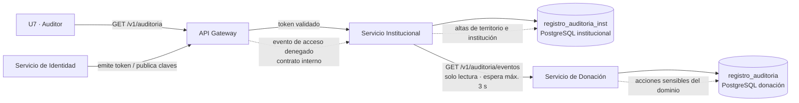

# ADR-010 — Almacenamiento distribuido de la bitácora de auditoría con consulta compuesta

| Campo | Contenido |
|---|---|
| **Identificador y título** | ADR-010. Almacenamiento distribuido de la bitácora de auditoría con consulta compuesta. |
| **Estado** | Aceptada. Deliberada y aprobada en Mesa de Arquitectura del 21 de septiembre de 2026. Revisada el 22 de septiembre de 2026 para alinearla con la separación del Servicio de Identidad definida en la arquitectura vigente. Depende de ADR-003, arquitectura distribuida por contextos acotados, y de ADR-005, base de datos relacional con esquema independiente por servicio. |
| **Restricciones aplicables** | RD-01, RD-08, RN-01 (Ley 1581 de 2012), RI-03, RI-04. |
| **Fecha** | 21 de septiembre de 2026. Revisión: 22 de septiembre de 2026. |

---

## Contexto

El servicio transversal de auditoría, ST2, no pertenece a un único módulo funcional. Los servicios propietarios generan registros de los hechos que ocurren dentro de sus contextos y el API Gateway genera eventos asociados al acceso y al rechazo de solicitudes.

La arquitectura vigente separa el **Servicio de Identidad** del **Servicio Institucional**. Identidad es responsable de autenticación, emisión de token, rol y atributos necesarios para autorización; Institucional conserva la jerarquía institucional y territorial y las relaciones de jurisdicción propias de su contexto.

Esta separación obliga a distinguir entre **quién autentica al usuario** y **dónde se almacena y consulta la bitácora de auditoría**. La existencia del Servicio de Identidad no implica crear una base de auditoría adicional ni trasladar la consulta del auditor a ese servicio.

La arquitectura distribuida debe resolver dos cosas de manera conjunta: **dónde se almacenan los registros** y **desde dónde se sirve la consulta**. La decisión debe conservar la propiedad exclusiva de los datos y evitar que un servicio escriba directamente en la base de otro.

De esa decisión depende una medida de respuesta concreta: que el auditor reconstruya la cadena completa de eventos de una unidad, de la captación a la disposición final, en menos de cinco minutos y sin apoyo del equipo técnico.

La cuestión abierta P-08, vista de inventario del perfil auditor, depende de este registro y no puede resolverse antes.

---

## Opciones consideradas

### Opción A — Bitácora única en el Servicio de Donación

Todos los registros se almacenarían en la base del contexto de donación.

Esto obligaría a que otros contextos escribieran directa o indirectamente en la persistencia de Donación. La escritura directa incumpliría ADR-005 y la escritura a través de una operación remota introduciría una dependencia de red para hechos que pertenecen a otros contextos.

**Descartada.**

### Opción B — Bitácora única en el Servicio Institucional

Todos los registros se almacenarían en la base institucional.

Esto obligaría a que las acciones sensibles del dominio de donación dependieran de una llamada remota para quedar auditadas y rompería la posibilidad de registrar el evento dentro de la misma transacción que modifica el estado de la unidad.

**Descartada.**

### Opción C — Almacenamiento por contexto, consulta compuesta

Cada servicio propietario registra los hechos de las entidades que posee dentro de su propia persistencia. La consulta del auditor se sirve desde un único punto y compone la información necesaria mediante contratos de solo lectura.

La separación del Servicio de Identidad no modifica esta decisión: identidad no se convierte en repositorio general de auditoría y sus eventos de acceso se integran mediante contratos, sin acceso directo a bases ajenas.

**Seleccionada.**

### Opción D — Composición en el API Gateway

El gateway agregaría las series de auditoría.

Se descarta porque la responsabilidad del gateway excluye lógica de dominio. Ordenar, fusionar, degradar y presentar una bitácora compuesta pertenece a la capa de aplicación responsable de la consulta, no al componente de entrada.

**Descartada.**

---

## Compromiso evaluado

**Se gana.** La propiedad exclusiva de datos se conserva y la regla de integridad que ata un evento sensible a la transición de estado puede seguir aplicándose dentro de una misma transacción cuando ambos pertenecen al mismo contexto.

La separación del Servicio de Identidad queda respetada: autenticación y autorización no se confunden con almacenamiento de auditoría y ningún servicio obtiene acceso directo a la persistencia de otro.

**Se sacrifica.** La consulta del auditor deja de ser una lectura puramente local y depende de una composición entre contextos. Esa composición queda sujeta a espera máxima, degradación explícita y ordenamiento por marca temporal e identificador de correlación.

También se acepta que determinados eventos generados por el gateway o asociados a identidad deban llegar al almacenamiento de auditoría mediante contratos internos, en lugar de asumir que comparten proceso o base de datos con el Servicio Institucional.

---

## Decisión

1. **Se conservan entidades de auditoría de solo anexado en los contextos propietarios de los hechos auditados.** La bitácora de Donación permanece en la persistencia del Servicio de Donación y la bitácora institucional permanece en la persistencia del Servicio Institucional.

2. **El Servicio de Identidad es el propietario de autenticación, emisión de token, rol y atributos de autorización.** Esta responsabilidad no se atribuye al Servicio Institucional.

3. **La consulta del auditor se sirve desde el Servicio Institucional.** La razón es que la consulta cruza información institucional, territorial y de trazabilidad y requiere componer los registros disponibles sin convertir al Servicio de Identidad en servicio de consulta de auditoría.

4. **La jurisdicción usada para autorizar la consulta se obtiene de las credenciales validadas y de las reglas vigentes de autorización.** El Servicio Institucional no se considera propietario de la identidad por servir la consulta.

5. **El Servicio de Donación publica una operación de solo lectura**, `GET /v1/auditoria/eventos`, invocable por el componente autorizado para componer la consulta. Esta operación no permite escritura ni expone contenido clínico.

6. **Los eventos de acceso denegado generados por el API Gateway se registran mediante un contrato interno de auditoría y no mediante acceso directo a una base de datos.** Su persistencia se integra en la bitácora institucional mientras la arquitectura no defina un repositorio de auditoría independiente.

7. **El API Gateway no comparte base de datos ni responsabilidad de identidad con el Servicio Institucional.** La separación entre gateway, Identidad e Institucional se mantiene explícita.

8. **La composición es determinista.** Las series se ordenan por marca temporal en tiempo universal coordinado y se agrupan por identificador de correlación.

9. **La degradación es explícita.** Si el Servicio de Donación no responde dentro del plazo definido, la respuesta se entrega con la información disponible y con la marca `bitacora_parcial`, indicando qué contexto no pudo consultarse. Ninguna respuesta parcial se presenta como completa.

---

## Justificación

La decisión separa tres responsabilidades que no deben confundirse:

- **Identidad** autentica, emite credenciales y mantiene la información necesaria para reconocer al actor.
- **Institucional** administra la estructura institucional y territorial y sirve la consulta compuesta del auditor.
- **Donación** conserva los eventos vinculados a las transiciones sensibles de su propio dominio.

La separación del Servicio de Identidad corrige la arquitectura anterior sin obligar a rediseñar la estrategia de auditoría. La bitácora sigue distribuida porque la propiedad del dato continúa siendo el criterio principal.

El argumento determinante sigue siendo la integridad transaccional: los eventos que deben quedar ligados a una transición de dominio deben almacenarse donde esa transición puede confirmarse en la misma transacción.

El gateway tampoco se convierte en repositorio de auditoría. Genera eventos, pero los entrega mediante contrato al componente responsable de persistirlos. Esto evita tanto acceso directo a bases ajenas como acoplamiento por plataforma de ejecución.

El costo aceptado sigue siendo cambiar una garantía fuerte de lectura local por una garantía fuerte de escritura distribuida por propietario. Para auditoría, preservar la existencia e integridad del registro tiene prioridad sobre evitar una composición de lectura.

---

## Vigencia de lo elegido

La decisión permanece vigente mientras la auditoría continúe distribuida según la propiedad de los datos y la consulta requiera reconstruir hechos de más de un contexto.

La separación del Servicio de Identidad no invalida la decisión principal de este ADR. Si en el futuro se crea un servicio de auditoría independiente con almacenamiento propio, esta decisión deberá revisarse mediante un nuevo ADR.

---

## Consecuencias

**Sobre la arquitectura.** ST2 continúa como capacidad transversal con almacenamiento distribuido y consulta compuesta. El Servicio de Identidad queda separado del Servicio Institucional y no se convierte por ello en repositorio general de auditoría.

**Sobre Identidad.** Autenticación, emisión de token, rol y atributos de autorización pertenecen al Servicio de Identidad. El hecho de que una consulta de auditoría se sirva desde Institucional no modifica esa propiedad.

**Sobre los contratos.** El Servicio de Donación conserva una operación de solo lectura para exponer eventos de auditoría al componente autorizado para componer la consulta. Los eventos del gateway llegan al almacenamiento de auditoría mediante contrato interno y nunca por acceso directo a la base institucional.

**Sobre la seguridad.** El gateway valida las credenciales y los servicios mantienen sus controles propios. La consulta del auditor se autoriza conforme a la matriz normativa vigente y a la jurisdicción contenida o derivada de las credenciales validadas.

**Sobre la verificación.** El escenario de no repudio conserva su medida de cinco minutos sobre la consulta compuesta. Debe verificarse también la degradación cuando Donación no está disponible y la persistencia de un acceso denegado generado por el gateway.

**Sobre las cuestiones abiertas.** P-08 conserva resuelta su dependencia arquitectónica: la vista del auditor se construye sobre una consulta servida desde el Servicio Institucional, sin convertir a Institucional en propietario de identidad.

**Sobre el Tech Radar.** Ninguna entrada nace, cambia de anillo ni se retira como consecuencia de esta revisión.

**Riesgo aceptado.** La consulta de auditoría continúa atravesando fronteras de servicio. La separación adicional del Servicio de Identidad aumenta la importancia de mantener contratos claros y evitar que la consulta dependa de una llamada síncrona a Identidad para cada registro.

---

## Responsable y fecha de revisión

| Rol | Responsabilidad |
|---|---|
| Arquitecta de Software | Coherencia entre la separación de Identidad, la estrategia de auditoría y los documentos que la recogen. |
| QA / Tester | Medida de respuesta del escenario de no repudio, degradación de la consulta y persistencia de accesos denegados. |

**Próxima revisión:** cierre del Sprint 3, con la primera consulta del auditor en ejecución sobre el ambiente de demostración y la separación de Identidad verificada en las vistas de arquitectura.
