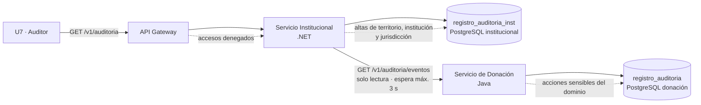

# ADR-010 — Almacenamiento distribuido de la bitácora de auditoría con consulta compuesta

| Campo | Contenido |
|---|---|
| **Identificador y título** | ADR-010. Almacenamiento distribuido de la bitácora de auditoría con consulta compuesta. |
| **Estado** | Aceptada. Deliberada y aprobada en Mesa de Arquitectura del 21 de septiembre de 2026. Depende de ADR-003, arquitectura distribuida por contextos acotados, y de ADR-005, base de datos relacional con esquema independiente por servicio. No reemplaza a ningún registro anterior. |
| **Restricciones aplicables** | RD-01, RD-08, RN-01 (Ley 1581 de 2012), RI-03, RI-04. |
| **Fecha** | 21 de septiembre de 2026. |

---

## Contexto

El servicio transversal de auditoría, ST2, es el único elemento del sistema cuyo dueño no es un módulo funcional. Lo escriben los dos servicios propietarios y el API Gateway, y lo consulta un perfil —el auditor, U7— que no tiene módulo de referencia.

La arquitectura distribuida obliga a decidir dos cosas que hasta ahora no estaban resueltas de forma conjunta: **dónde se almacenan los registros** y **desde dónde se sirve la consulta**. Las dos decisiones interactúan, porque el modelo de datos declara dos entidades de solo anexado —una por contexto— y la operación de consulta del auditor es una sola.

De esa decisión depende una medida de respuesta concreta: que el auditor reconstruya la cadena completa de eventos de una unidad, de la captación a la disposición final, en menos de cinco minutos y sin apoyo del equipo técnico. Mientras la ubicación del almacenamiento y la de la consulta no estén fijadas de forma coherente, esa medida no es verificable.

La cuestión abierta P-08, vista de inventario del perfil auditor, depende de este registro y no puede resolverse antes.

---

## Opciones consideradas

### Opción A — Bitácora única en el Servicio de Donación

Todos los registros se almacenan en la base del contexto de donación, que es donde ocurren las acciones sensibles del dominio.

El Servicio Institucional tendría que escribir allí sus propios registros, y solo hay dos formas de conseguirlo. La primera es escribir directamente en la base ajena, lo que incumple ADR-005 y materializa el acoplamiento por la capa de persistencia que el killer K-04 vigila. La segunda es exponer una operación de escritura del Servicio de Donación invocable por el Institucional, lo que elimina la garantía estructural de que el contexto institucional nunca escribe en el de donación —la garantía que hace de RI-03 una propiedad del contrato y no una promesa de código.

**Descartada.**

### Opción B — Bitácora única en el Servicio Institucional

Simétrica de la anterior, con el mismo defecto en sentido inverso y una consecuencia adicional de desempeño: las acciones sensibles del dominio —marcar una unidad como no apta, ejecutar su disposición final, aprobar una transferencia— ocurren todas en el contexto de donación, de modo que el registro de auditoría cruzaría la red en el camino crítico de cada transición de estado.

Además impediría imponer la regla de integridad que exige insertar el evento en la misma transacción que actualiza el estado de la unidad: una transacción de base de datos no abarca una llamada entre servicios.

**Descartada.**

### Opción C — Almacenamiento por contexto, consulta compuesta

Cada servicio escribe los registros de las entidades que posee, en su propia base. La consulta del auditor se sirve desde un único punto, que compone ambas series invocando al otro contexto por contrato de solo lectura.

**Seleccionada.**

### Opción D — Composición en el API Gateway

El gateway agregaría las dos series al vuelo. Se descarta porque la responsabilidad declarada del gateway excluye la lógica de dominio, y ordenar y fusionar dos series de eventos de auditoría lo es.

**Descartada.**

---

## Compromiso evaluado

**Se gana.** La propiedad exclusiva de datos se conserva intacta y verificable por inspección del contrato. La regla de integridad que ata el evento a la transición sigue siendo imponible dentro de una transacción. Ninguna acción sensible del dominio paga una llamada de red para quedar registrada.

**Se sacrifica.** La consulta del auditor deja de ser una lectura local y pasa a depender de una llamada entre servicios, sujeta al plazo de espera de tres segundos y a la degradación declarada que rige toda comunicación entre contextos. Una respuesta parcial es un resultado posible del escenario de auditoría y el sistema debe declararla como tal. El orden total de los eventos deja de estar garantizado por el motor y pasa a depender de la marca temporal en tiempo universal coordinado, que la convención de modelado ya impone en todo el sistema.

---

## Decisión

1. **Se conservan dos entidades de solo anexado**, una por contexto: `registro_auditoria` en el Servicio de Donación y `registro_auditoria_inst` en el Servicio Institucional. Cada servicio escribe exclusivamente los registros de las entidades que posee.

2. **La consulta del auditor se sirve desde el Servicio Institucional.** El contexto de la identidad, el rol y la jurisdicción reside allí, y la bitácora se consulta siempre filtrada por jurisdicción.

3. **El Servicio de Donación publica una operación de solo lectura**, `GET /v1/auditoria/eventos`, invocable únicamente por el Servicio Institucional. Es la tercera operación del contrato del Institucional hacia Donación y no introduce escritura alguna, de modo que RI-03 se conserva.

4. **El API Gateway escribe sus registros de acceso denegado en el Servicio Institucional.** Un acceso denegado es un hecho de identidad y jurisdicción, cuyo contexto es el institucional; el gateway comparte con él plataforma de ejecución, de modo que no se introduce una dependencia nueva.

5. **La composición es determinista.** Las dos series se ordenan por marca temporal en tiempo universal coordinado y se agrupan por identificador de correlación, ambos ya presentes en el modelo de datos.

6. **La degradación es explícita.** Si el Servicio de Donación no responde dentro del plazo de tres segundos, la respuesta se entrega con los registros institucionales disponibles y con la marca `bitacora_parcial`, que nombra el contexto ausente. Ninguna respuesta parcial se presenta como completa.

---

## Justificación

La opción elegida es la única que no obliga a romper una regla declarada inviolable en la arquitectura. Las opciones A y B exigen, cada una, que un servicio escriba en el contexto del otro; ese es precisamente el acoplamiento que ADR-003 y ADR-005 existen para impedir.

El argumento determinante es de integridad transaccional. La regla que exige insertar el evento de trazabilidad en la misma transacción que actualiza el estado de la unidad solo es imponible si el evento y la unidad residen en la misma base de datos. Cualquier disposición que saque la bitácora del dominio de donación convierte una restricción que el motor garantiza en una que depende de disciplina de código.

El costo aceptado es explícito: se cambia una garantía fuerte de lectura por una garantía fuerte de escritura. Para una bitácora de auditoría ese intercambio es el correcto. Un registro que se escribe siempre y se lee ocasionalmente con retraso sirve a la auditoría; uno que se lee rápido pero puede no haberse escrito, no.

---

## Vigencia de lo elegido

No aplica. La decisión no selecciona una tecnología con ventana de soporte: distribuye una responsabilidad entre componentes ya adoptados en el catálogo de herramientas.

---

## Consecuencias

**Sobre la arquitectura.** ST2 se describe como servicio transversal con almacenamiento distribuido y consulta compuesta. La tabla de reparto de módulos y servicios transversales y la de entidades por servicio recogen esa descripción.

**Sobre los contratos.** El contrato del Servicio de Donación consumido por el Institucional pasa de dos a tres operaciones. La operación nueva devuelve marca temporal, tipo y ámbito del actor, rol, jurisdicción, operación, recurso, resultado e identificador de correlación. No devuelve el contenido del recurso auditado ni dato clínico alguno.

**Sobre la verificación.** El escenario de no repudio conserva su medida de cinco minutos, ahora medida sobre la consulta compuesta, y añade la condición de degradación: ante indisponibilidad del contexto par, la respuesta declara qué parte de la bitácora falta. El escenario de aislamiento del fallo del servicio par gana un caso de prueba, la consulta de auditoría con el Servicio de Donación fuera de servicio.

**Sobre las cuestiones abiertas.** P-08 queda resuelta en su dependencia arquitectónica: la vista del perfil auditor se construye sobre el Servicio Institucional.

**Sobre el Tech Radar.** Ninguna entrada nace, cambia de anillo ni se retira.

**Riesgo aceptado.** La consulta de auditoría es la segunda operación del sistema que atraviesa la frontera entre contextos en una sola acción de usuario, después de la transferencia entre bancos. Se incorpora al registro de riesgos con esa calificación.

---

## Responsable y fecha de revisión

| Rol | Responsabilidad |
|---|---|
| Arquitecta de Software | Implementación de la decisión y coherencia de los documentos que la recogen. |
| QA / Tester | Medida de respuesta del escenario de no repudio sobre la consulta compuesta. |

**Próxima revisión:** cierre del Sprint 3, con la primera consulta del auditor en ejecución sobre el ambiente de demostración.
